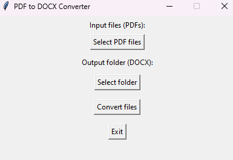

<p align="center">
  
</p>

<h1 align="center">🧩 PDFtoDOCX Converter</h1>
<p align="center">
  A simple and user-friendly desktop tool to batch convert PDF files to DOCX using a Tkinter-based GUI.
</p>

<p align="center">
  
  
  
  
  
</p>


## 🚀 Features

- 🔄 Convert one or multiple **PDF files → DOCX**
- 📂 Choose custom **output folder**
- 🎨 Simple & intuitive **GUI**
- 🖼️ **Custom desktop icon**
- 🐍 100% built in **Python**


## 🖼️ Screenshots

<p align="center">
  <br/>
  <em>Main application interface</em>
</p>

<p align="center">
  <br/>
  <em>Conversion success message</em>
</p>

## 🛠️ Installation

### 🔹 For End Users (Executable)
1. Download the latest `.zip` release from [Releases](https://github.com/mircothibes/pdf-to-docx-converter/releases).
2. Extract all contents.
3. Double-click `gui.exe` or use the desktop shortcut.
4. Select PDFs → Choose output folder → Convert ✅

### 🔹 For Developers (Run via Python)
Requirements:  
- Python 3.11+  
- Virtual environment (recommended)  

```bash
git clone https://github.com/mircothibes/pdf-to-docx-converter.git
cd pdf-to-docx-converter
python -m venv .venv
.venv\Scripts\activate   # Windows
pip install -e .
```

