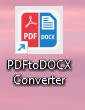
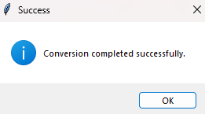

# 🧩 PDFtoDOCX Converter

A simple and user-friendly desktop application to batch convert `.pdf` files to `.docx` format using a clean graphical interface built with **Tkinter**.

## 🚀 Features

- ✅ Convert one or multiple PDF files to DOCX format.
- ✅ Select output folder for saving the converted files.
- ✅ Simple and intuitive GUI.
- ✅ Desktop shortcut with custom icon.
- ✅ Built with Python 🐍.

---

## 🖼️ Screenshots

### Application Icon


### Main Interface


### Success Message


---

## 📁 Project Structure

pdf-to-docx-converter/
│
├── src/
│ └── my_package/
│ ├── gui.py
│ └── main.py
│
├── inputs_pdfs/
├── outputs_docx/
├── logs/
├── dist/
│ └── gui.exe
│
├── scripts/
│ └── create_shortcut.ps1
│
├── icon.ico
├── README.md
├── pyproject.toml
├── setup.py
├── requirements.txt
└── .gitignore


---

## 🛠️ Installation (Executable)

1. Download the latest `.zip` release from the [Releases](https://github.com/your-username/your-repo-name/releases) section.
2. Extract all contents.
3. Double-click `gui.exe` or use the **desktop shortcut**.
4. Select PDFs → Output folder → Convert. Done!

---

## 🐍 Run via Python (Developers)

### Requirements

- Python 3.11+
- Virtualenv recommended

### Installation

```bash
git clone https://github.com/mircothibes/pdf-to-docx-converter.git
cd pdf-to-docx-converter
python -m venv .venv
.venv\Scripts\activate
pip install -e .


Then run:
pdf2docx-gui

📦 Build Executable
To generate a .exe version (Windows):
pyinstaller --noconsole --onefile --icon=icone.ico src/my_package/gui.py
Output will appear in the dist/ folder.

🧑‍💻 Author
Developed by Marcos Kemer

📄 License
This project is licensed under the MIT License.